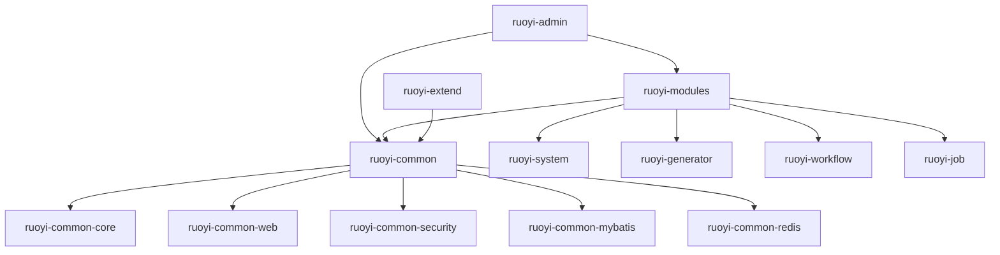

# RuoYi-Vue-Plus 企业级全栈开发平台

<div align="center">

</div>

<div align="center">

[](https://gitee.com/dromara/RuoYi-Vue-Plus)
[](https://github.com/dromara/RuoYi-Vue-Plus)
[](https://gitcode.com/dromara/RuoYi-Vue-Plus)
[](https://gitee.com/dromara/RuoYi-Vue-Plus/blob/5.X/LICENSE)
[](https://www.jetbrains.com/?from=RuoYi-Vue-Plus)

[](https://gitee.com/dromara/RuoYi-Vue-Plus)
[]()
[]()
[]()

**基于 Spring Boot 3.4 + Vue 3 + TypeScript 的企业级分布式微服务架构**

**支持多租户、工作流、代码生成、分布式事务、国际化、SSO单点登录**

</div>

---

## 📋 目录

- [项目概述](#-项目概述)
- [核心特性](#-核心特性)
- [技术架构](#-技术架构)
- [模块化设计](#-模块化设计)
- [脚手架生成系统](#-脚手架生成系统)
- [技术栈说明](#-技术栈说明)
- [快速开始](#-快速开始)
- [开发指南](#-开发指南)
- [部署运维](#-部署运维)
- [扩展定制](#-扩展定制)
- [性能优化](#-性能优化)
- [常见问题](#-常见问题)

---

## 🚀 项目概述

**RuoYi-Vue-Plus** 是基于 RuoYi-Vue 进行重构升级的企业级全栈开发平台，专门针对 **分布式集群与多租户** 场景进行全方位优化。项目采用主流的微服务架构，集成了当前最新的技术栈，提供了完整的权限管理、多租户、工作流、代码生成等企业级功能。

### 🎯 设计理念

- **模块化架构**: 采用插件化设计，结构解耦，易于扩展
- **分布式优先**: 天生支持分布式部署，无单点故障
- **多租户支持**: 完整的SaaS多租户解决方案
- **开发效率**: 提供强大的代码生成器，降低80%开发量
- **企业级特性**: 集成监控、日志、安全、性能优化等企业级功能

### 📊 项目数据

- **开源时间**: 2021年至今
- **代码提交**: 2000+ commits
- **社区活跃度**: GitHub 8k+ stars, Gitee 4k+ stars  
- **生产使用**: 500+ 企业生产环境使用
- **技术支持**: 提供完整文档和技术支持群

---

## 🎯 核心特性

### 🏗️ 架构特性
- **🔥 微服务架构**: 基于Spring Boot 3.4的分布式微服务架构
- **🚀 高性能**: 采用Undertow容器，性能比Tomcat提升30%
- **🔒 安全认证**: Sa-Token + JWT双重安全保障
- **🏢 多租户**: 完整的SaaS多租户解决方案，支持租户隔离
- **⚡ 分布式**: 支持分布式锁、缓存、任务调度、事务

### 💻 技术特性  
- **📊 数据库**: 支持MySQL、Oracle、PostgreSQL、SQLServer多数据库
- **📝 ORM框架**: MyBatis-Plus 3.5，支持多数据源、分页、数据权限
- **🗄️ 缓存**: Redisson客户端，支持Redis集群、哨兵模式
- **📄 文档**: SpringDoc + JavaDoc零侵入API文档生成
- **📱 前端**: Vue3 + TypeScript + Element Plus

### 🛠️ 开发特性
- **⚙️ 代码生成**: 智能代码生成器，支持多数据源、自定义模板
- **🔧 脚手架系统**: 自动化项目构建，支持模块化定制
- **🎨 模板引擎**: FreeMarker模板处理，支持动态配置
- **📦 模块化**: 插件化架构，按需加载功能模块

### 🔍 监控运维
- **📈 应用监控**: Spring Boot Admin实时监控
- **🔎 链路追踪**: SkyWalking分布式链路追踪  
- **📋 日志管理**: 统一日志收集和分析
- **🐳 容器化**: Docker一键部署，支持K8s编排

---

## 🏛️ 技术架构

### 🎯 整体架构图

```
┌─────────────────────────────────────────────────────────────────┐
│                        前端层 (Presentation)                      │
├─────────────────────────────────────────────────────────────────┤
│  Vue3 + TS    │  Element Plus  │  Pinia State   │  Vue Router   │
├─────────────────────────────────────────────────────────────────┤
│                         网关层 (Gateway)                         │
├─────────────────────────────────────────────────────────────────┤
│    负载均衡     │     API网关      │    服务发现     │    熔断降级    │
├─────────────────────────────────────────────────────────────────┤
│                        业务层 (Business)                         │
├─────────────────────────────────────────────────────────────────┤
│  ruoyi-admin  │ ruoyi-system  │ ruoyi-generator │ ruoyi-workflow │
├─────────────────────────────────────────────────────────────────┤
│                        服务层 (Service)                          │
├─────────────────────────────────────────────────────────────────┤
│  权限认证服务    │  多租户服务     │  文件存储服务     │  消息推送服务   │
├─────────────────────────────────────────────────────────────────┤
│                        数据层 (Data)                             │
├─────────────────────────────────────────────────────────────────┤
│   MySQL/PG    │    Redis     │    MinIO     │   ClickHouse     │
└─────────────────────────────────────────────────────────────────┘
```

### 🔗 分层架构详解

#### 1️⃣ 表现层 (Presentation Layer)
```yaml
技术栈:
  - Vue 3.x: 渐进式JavaScript框架
  - TypeScript: 静态类型检查
  - Element Plus: UI组件库
  - Pinia: 状态管理
  - Vue Router: 路由管理
  - Axios: HTTP客户端

职责:
  - 用户界面展示
  - 用户交互处理  
  - 状态管理
  - 路由控制
```

#### 2️⃣ 网关层 (Gateway Layer)  
```yaml
技术栈:
  - Spring Cloud Gateway: API网关
  - LoadBalancer: 负载均衡
  - Hystrix: 熔断降级
  - Consul/Nacos: 服务发现

职责:
  - 请求路由转发
  - 负载均衡
  - 服务熔断
  - 限流防护
  - 统一鉴权
```

#### 3️⃣ 业务层 (Business Layer)
```yaml
核心模块:
  ruoyi-admin: 
    - 系统启动入口
    - 统一配置管理
    - 集成测试
    
  ruoyi-system:
    - 用户权限管理
    - 组织架构管理
    - 字典参数管理
    - 操作日志管理
    
  ruoyi-generator:
    - 代码生成引擎
    - 模板管理
    - 数据库逆向工程
    
  ruoyi-workflow:
    - 工作流引擎
    - 流程设计器
    - 任务处理
```

#### 4️⃣ 服务层 (Service Layer)
```yaml
通用服务:
  - 认证服务: Sa-Token + JWT
  - 多租户服务: 租户隔离与管理
  - 文件服务: MinIO分布式存储
  - 消息服务: WebSocket + SSE
  - 缓存服务: Redis分布式缓存
  - 搜索服务: ElasticSearch全文检索
```

#### 5️⃣ 数据层 (Data Layer)
```yaml
数据存储:
  - MySQL: 主业务数据存储
  - PostgreSQL: 复杂查询和分析
  - Redis: 缓存和会话存储
  - MinIO: 文件对象存储
  - ClickHouse: 日志和指标存储
```

---

## 🧩 模块化设计

RuoYi-Vue-Plus 采用精心设计的模块化架构，每个模块职责清晰，便于维护和扩展。

### 📦 核心模块结构

```
ruoyi-vue-plus/
├── ruoyi-admin/                 # 🚀 启动模块
│   ├── src/main/java           # 应用启动类
│   ├── src/main/resources      # 核心配置文件  
│   └── src/test/               # 集成测试
├── ruoyi-common/               # 🔧 通用模块
│   ├── ruoyi-common-core/      # 核心工具类
│   ├── ruoyi-common-web/       # Web通用组件
│   ├── ruoyi-common-security/  # 安全认证组件
│   ├── ruoyi-common-mybatis/   # 数据库操作组件
│   ├── ruoyi-common-redis/     # 缓存操作组件
│   ├── ruoyi-common-oss/       # 对象存储组件
│   ├── ruoyi-common-sms/       # 短信服务组件
│   ├── ruoyi-common-mail/      # 邮件服务组件
│   └── ...                     # 其他通用组件
├── ruoyi-modules/              # 📋 业务模块
│   ├── ruoyi-system/           # 系统管理模块
│   ├── ruoyi-generator/        # 代码生成模块
│   ├── ruoyi-job/              # 定时任务模块
│   ├── ruoyi-workflow/         # 工作流模块
│   └── ruoyi-demo/             # 示例演示模块
└── ruoyi-extend/               # 🔌 扩展模块
    ├── ruoyi-monitor-admin/    # 监控中心
    └── ruoyi-snailjob-server/  # 任务调度服务
```

### 🏗️ 模块详细说明

#### 1️⃣ ruoyi-admin (启动模块)
```yaml
职责: 系统启动入口和全局配置
主要功能:
  - SpringBoot应用启动类
  - 全局配置文件管理
  - 集成测试用例
  - 系统启动监听器

技术特点:
  - 统一异常处理
  - 全局跨域配置
  - API接口文档配置
  - 系统启动预检查

关键文件:
  - RuoYiApplication.java: 启动类
  - application.yml: 主配置文件
  - application-dev.yml: 开发环境配置
  - application-prod.yml: 生产环境配置
```

#### 2️⃣ ruoyi-common (通用模块)
```yaml
ruoyi-common-core:
  - 通用工具类 (DateUtils, StringUtils等)
  - 常量定义
  - 异常类定义
  - 基础实体类

ruoyi-common-web:
  - Web层通用组件
  - 全局异常处理器
  - 跨域配置
  - 参数校验

ruoyi-common-security:
  - Sa-Token集成
  - JWT工具类
  - 权限校验注解
  - 登录认证逻辑

ruoyi-common-mybatis:
  - MyBatis-Plus配置
  - 数据权限插件
  - 多租户插件
  - 分页插件

ruoyi-common-redis:
  - Redisson客户端配置
  - 缓存注解扩展
  - 分布式锁工具
  - 限流组件

ruoyi-common-oss:
  - MinIO集成
  - 文件上传下载
  - 文件预览
  - 云存储适配

技术优势:
  - 高度解耦: 每个common模块独立
  - 按需引入: 只引入需要的功能
  - 统一标准: 统一的工具类和规范
  - 易于扩展: 插件化设计便于扩展
```

#### 3️⃣ ruoyi-modules (业务模块)
```yaml
ruoyi-system (系统管理):
  功能范围:
    - 用户管理: 用户增删改查、角色分配
    - 角色管理: 角色权限配置、数据权限
    - 菜单管理: 系统菜单、按钮权限配置  
    - 部门管理: 组织架构管理
    - 岗位管理: 岗位信息维护
    - 字典管理: 数据字典维护
    - 参数管理: 系统参数配置
    - 通知公告: 系统消息发布
    - 日志管理: 操作日志、登录日志
    - 在线用户: 会话管理、强制下线
    
  技术实现:
    - 基于RBAC权限模型
    - 支持数据权限过滤
    - 树形结构数据处理
    - 多条件动态查询

ruoyi-generator (代码生成):
  功能范围:
    - 数据库表导入
    - 代码模板配置
    - 批量代码生成
    - 支持多数据源
    - 自定义模板
    
  生成内容:
    - Java实体类、Mapper、Service、Controller
    - Vue3前端页面、API接口
    - SQL建表语句
    - 菜单权限SQL

ruoyi-workflow (工作流):
  功能范围:
    - 流程设计器
    - 流程部署管理
    - 任务处理
    - 流程监控
    
  技术特点:
    - 可视化流程设计
    - 多种节点类型
    - 条件分支支持
    - 会签、或签功能

ruoyi-job (定时任务):
  功能范围:
    - 任务调度管理
    - 任务执行监控
    - 执行日志记录
    - 集群支持
    
  技术实现:
    - 基于SnailJob框架
    - 支持分布式调度
    - 支持任务分片
    - 失败重试机制
```

#### 4️⃣ ruoyi-extend (扩展模块)
```yaml
ruoyi-monitor-admin (监控中心):
  监控功能:
    - 应用状态监控
    - JVM指标监控
    - 接口调用统计
    - 系统日志查看
    
  技术实现:
    - Spring Boot Admin
    - Actuator健康检查
    - 实时数据推送
    - 告警通知

ruoyi-snailjob-server (任务调度服务):
  调度功能:
    - 分布式任务调度
    - 任务分片执行
    - 失败重试
    - 任务依赖管理
    
  技术优势:
    - 高可用设计
    - 水平扩展
    - 可视化管理
    - 性能监控
```

### 🔗 模块依赖关系



---

## 🏗️ 脚手架生成系统

RuoYi-Vue-Plus 提供了强大的脚手架生成系统，可以根据业务需求自动生成定制化的项目结构。

### 🎯 系统概述

脚手架系统采用**三阶段处理模式**，通过智能分析和自动化处理，生成符合企业需求的项目代码：

```
原始项目 → 模块裁剪 → POM更新 → 模板处理 → 包名重构 → SQL生成 → 最终项目
```

### 🔧 核心实现架构

#### Phase 1: FTL模板转换引擎

**核心文件**: `scaffolding_service.py`

```python
class ScaffoldingService:
    """脚手架生成主服务"""
    
    def _process_ftl_template(self, content: str, project_config: Dict) -> str:
        """处理 FreeMarker 模板内容"""
        # 1. 处理条件语句 <#if>
        # 2. 处理循环语句 <#list>  
        # 3. 多轮变量替换，确保嵌套变量处理
        # 4. 智能配置解析
```

**技术特点**:
- **智能模板解析**: 支持FreeMarker语法，包括条件判断、循环、变量替换
- **多轮变量替换**: 最多3轮替换，确保嵌套变量正确处理
- **配置驱动**: 基于JSON配置文件动态生成内容
- **错误容错**: 模板处理失败时自动降级到基础变量替换

#### Phase 2: 动态SQL生成系统

**核心文件**: `sql_processor.py`

```python
class SqlProcessor:
    """SQL 处理器"""
    
    def generate_final_script(self, project_config: Dict) -> str:
        """生成最终初始化脚本"""
        # 1. 解析现有SQL文件
        # 2. 根据模块配置过滤SQL
        # 3. 生成自定义实体SQL
        # 4. 合并生成最终脚本
```

**智能SQL处理流程**:

1. **模块映射分析**
   ```yaml
   表前缀映射:
     sys_: ruoyi-system     # 系统管理模块
     gen_: ruoyi-generator  # 代码生成模块
     sj_: ruoyi-job        # 定时任务模块
     wf_: ruoyi-workflow   # 工作流模块
   ```

2. **智能过滤机制**
   - 根据`modulesToKeep`配置自动过滤SQL
   - 保留核心表结构
   - 移除不需要的模块表

3. **自定义实体生成**
   ```python
   # 自动生成业务表结构
   def _generate_table_sql(self, entity: CustomEntity) -> str:
       # 根据字段配置生成完整的CREATE TABLE语句
       # 支持主键、索引、注释、约束等
   ```

4. **最终脚本合成**
   - 生成完整的`init.sql`初始化脚本
   - 包含表结构、基础数据、权限数据
   - 自动添加时间戳和版本信息

#### Phase 3: 服务编排集成

**核心流程**:

```python
def generate_project(self, project_config: Dict, output_dir: str) -> str:
    """完整的项目生成流程"""
    
    # Step 1: 复制基础项目文件
    self._copy_base_project(output_path)
    
    # Step 2: 执行模块裁剪
    self._trim_modules(output_path, modules_to_keep)
    
    # Step 3: 修改POM配置
    self._update_pom_files(output_path, project_config)
    
    # Step 4: 处理FTL模板
    self._process_templates(output_path, project_config)
    
    # Step 5: 执行包名重构
    self._refactor_package_names(output_path, project_config)
    
    # Step 6: 生成初始化SQL
    self._generate_init_sql(output_path, project_config)
    
    # Step 7: 清理和验证
    self._cleanup_generated_project(output_path)
```

### 📋 配置文件详解

#### 项目配置结构

```json
{
  "projectMetadata": {
    "projectName": "智能管理系统",
    "groupId": "com.intelligent.admin", 
    "artifactId": "intelligent-admin-server",
    "version": "1.0.0-SNAPSHOT",
    "description": "基于RuoYi-Vue-Plus的智能管理系统",
    "author": "开发团队"
  },
  "backendConfig": {
    "modulesToKeep": [
      "ruoyi-admin",     // 必选：启动模块
      "ruoyi-common",    // 必选：通用模块  
      "ruoyi-system",    // 推荐：系统管理
      "ruoyi-generator"  // 可选：代码生成
    ]
  },
  "featureFlags": {
    "sse": {"enabled": true},           // SSE推送
    "websocket": {"enabled": false},    // WebSocket
    "tenant": {"enabled": true},        // 多租户
    "workflow": {"enabled": false},     // 工作流
    "job": {"enabled": false}           // 定时任务
  },
  "infrastructureConfig": {
    "database": {
      "type": "mysql",
      "host": "localhost", 
      "port": 3306,
      "username": "root",
      "password": "123456",
      "databaseName": "intelligent_db"
    },
    "redis": {
      "host": "localhost",
      "port": 6379,
      "password": "",
      "database": 0
    }
  },
  "customEntities": [
    {
      "tableName": "sys_notification",
      "className": "Notification", 
      "comment": "系统通知表",
      "fields": [
        {
          "name": "id",
          "type": "Long",
          "primaryKey": true,
          "comment": "通知ID"
        },
        {
          "name": "title", 
          "type": "String",
          "length": 200,
          "nullable": false,
          "comment": "通知标题"
        }
      ]
    }
  ]
}
```

### 🚀 使用示例

#### 基础项目生成

```python
from scaffolding_service import ScaffoldingService

# 创建服务实例
service = ScaffoldingService()

# 最小配置
config = {
    "projectMetadata": {
        "projectName": "我的项目",
        "groupId": "com.example.myproject",
        "artifactId": "my-project-server"
    },
    "backendConfig": {
        "modulesToKeep": ["ruoyi-admin", "ruoyi-common", "ruoyi-system"]
    }
}

# 生成项目
project_path = service.generate_project(config, "/path/to/output")
print(f"项目生成完成: {project_path}")
```

#### 高级功能定制

```python
# 包含工作流和多租户的企业版配置
enterprise_config = {
    "projectMetadata": {
        "projectName": "企业管理平台",
        "groupId": "com.enterprise.platform"
    },
    "backendConfig": {
        "modulesToKeep": [
            "ruoyi-admin", "ruoyi-common", "ruoyi-system", 
            "ruoyi-workflow", "ruoyi-generator"
        ]
    },
    "featureFlags": {
        "tenant": {"enabled": True},
        "workflow": {"enabled": True},
        "sse": {"enabled": True}
    },
    "customEntities": [
        {
            "tableName": "biz_order",
            "className": "Order",
            "comment": "订单表",
            "fields": [
                {"name": "id", "type": "Long", "primaryKey": True},
                {"name": "order_no", "type": "String", "length": 32},
                {"name": "amount", "type": "BigDecimal", "precision": 10, "scale": 2}
            ]
        }
    ]
}

# 生成企业版项目
enterprise_path = service.generate_project(enterprise_config, "/path/to/enterprise")
```

### 🔍 生成结果验证

生成的项目将包含：

1. **项目结构**: 完整的Maven多模块结构
2. **配置文件**: 数据库、Redis等基础设施配置
3. **启动类**: 可直接运行的SpringBoot应用
4. **初始化SQL**: 包含表结构和基础数据的SQL脚本
5. **自定义代码**: 根据customEntities生成的业务代码

**验证方式**:
```bash
# 1. 编译项目
mvn clean compile

# 2. 运行测试
mvn test

# 3. 启动应用
java -jar target/my-project-server.jar

# 4. 访问接口文档
curl http://localhost:8080/swagger-ui/index.html
```

---

## 💻 技术栈说明

### 🔨 后端技术栈

#### 🏗️ 核心框架
| 技术 | 版本 | 说明 | 官网 |
|------|------|------|------|
| Spring Boot | 3.4.7 | 核心框架，提供依赖注入、自动配置 | [spring.io](https://spring.io/projects/spring-boot) |
| Spring Framework | 6.x | 企业级应用框架 | [spring.io](https://spring.io) |
| Spring MVC | 6.x | MVC框架，RESTful API | [spring.io](https://spring.io/guides/gs/rest-service/) |
| Spring Security | 6.x | 安全框架（已替换为Sa-Token） | [spring.io](https://spring.io/projects/spring-security) |

#### 🔐 权限认证
| 技术 | 版本 | 说明 | 官网 |
|------|------|------|------|
| Sa-Token | 1.44.0 | 轻量级Java权限认证框架 | [sa-token.dev33.cn](https://sa-token.dev33.cn/) |
| JWT | - | JSON Web Token标准 | [jwt.io](https://jwt.io/) |
| JustAuth | 1.16.7 | 第三方登录工具类库 | [justauth.wiki](https://www.justauth.wiki/) |

#### 🗄️ 数据库相关
| 技术 | 版本 | 说明 | 官网 |
|------|------|------|------|
| MySQL | 8.0+ | 主数据库 | [mysql.com](https://www.mysql.com/) |
| PostgreSQL | 13+ | 支持的数据库 | [postgresql.org](https://www.postgresql.org/) |
| Oracle | 11g+ | 支持的数据库 | [oracle.com](https://www.oracle.com/database/) |
| MyBatis-Plus | 3.5.12 | MyBatis增强工具 | [baomidou.com](https://baomidou.com/) |
| HikariCP | - | 高性能数据库连接池 | [github.com/brettwooldridge/HikariCP](https://github.com/brettwooldridge/HikariCP) |
| p6spy | 3.9.1 | SQL监控工具 | [p6spy.readthedocs.io](https://p6spy.readthedocs.io/) |

#### 📦 缓存中间件
| 技术 | 版本 | 说明 | 官网 |
|------|------|------|------|
| Redis | 5.0+ | 内存数据库，缓存、会话存储 | [redis.io](https://redis.io/) |
| Redisson | 3.50.0 | Redis Java客户端 | [redisson.org](https://redisson.org/) |

#### 🔧 工具库
| 技术 | 版本 | 说明 | 官网 |
|------|------|------|------|
| Hutool | 5.8.38 | Java工具类库 | [hutool.cn](https://hutool.cn/) |
| Lombok | 1.18.36 | 简化Java代码 | [projectlombok.org](https://projectlombok.org/) |
| MapStruct Plus | 1.4.8 | 对象映射工具 | [mapstruct.org](https://mapstruct.org/) |
| Jackson | - | JSON处理库 | [github.com/FasterXML/jackson](https://github.com/FasterXML/jackson) |

#### 📝 文档相关
| 技术 | 版本 | 说明 | 官网 |
|------|------|------|------|
| SpringDoc | 2.8.8 | API文档生成 | [springdoc.org](https://springdoc.org/) |
| Therapi JavaDoc | 0.15.0 | JavaDoc注释支持 | [github.com/dnault/therapi-runtime-javadoc](https://github.com/dnault/therapi-runtime-javadoc) |

#### 🗂️ 存储相关
| 技术 | 版本 | 说明 | 官网 |
|------|------|------|------|
| MinIO | - | 对象存储服务 | [min.io](https://min.io/) |
| AWS SDK | 2.28.22 | 云存储SDK | [aws.amazon.com/sdk-for-java/](https://aws.amazon.com/sdk-for-java/) |

#### 📱 通信相关
| 技术 | 版本 | 说明 | 官网 |
|------|------|------|------|
| SMS4J | 3.3.4 | 短信发送工具 | [sms4j.com](https://sms4j.com/) |
| Spring Mail | - | 邮件发送 | [spring.io](https://spring.io/guides/gs/sending-email/) |

#### ⚙️ 分布式相关
| 技术 | 版本 | 说明 | 官网 |
|------|------|------|------|
| Lock4j | 2.2.7 | 分布式锁 | [gitee.com/baomidou/lock4j](https://gitee.com/baomidou/lock4j) |
| SnailJob | 1.5.0 | 分布式任务调度 | [snailjob.opensnail.com](https://snailjob.opensnail.com/) |
| Dynamic DataSource | 4.3.1 | 多数据源管理 | [dynamic-datasource.com](https://dynamic-datasource.com/) |

#### 📊 监控相关
| 技术 | 版本 | 说明 | 官网 |
|------|------|------|------|
| Spring Boot Admin | 3.4.7 | 应用监控 | [codecentric.github.io/spring-boot-admin/](https://codecentric.github.io/spring-boot-admin/) |
| SkyWalking | - | 分布式链路追踪 | [skywalking.apache.org](https://skywalking.apache.org/) |

### 🎨 前端技术栈

#### 🚀 核心框架
| 技术 | 版本 | 说明 | 官网 |
|------|------|------|------|
| Vue | 3.x | 渐进式JavaScript框架 | [vuejs.org](https://vuejs.org/) |
| TypeScript | 5.x | JavaScript超集，提供类型检查 | [typescriptlang.org](https://www.typescriptlang.org/) |
| Vite | 5.x | 前端构建工具 | [vitejs.dev](https://vitejs.dev/) |

#### 🎨 UI组件
| 技术 | 版本 | 说明 | 官网 |
|------|------|------|------|
| Element Plus | 2.x | Vue 3 UI组件库 | [element-plus.org](https://element-plus.org/) |
| Vue Router | 4.x | Vue官方路由管理器 | [router.vuejs.org](https://router.vuejs.org/) |
| Pinia | 2.x | Vue状态管理库 | [pinia.vuejs.org](https://pinia.vuejs.org/) |

#### 🔧 工具库
| 技术 | 版本 | 说明 | 官网 |
|------|------|------|------|
| Axios | 1.x | HTTP客户端 | [axios-http.com](https://axios-http.com/) |
| Lodash | 4.x | JavaScript工具库 | [lodash.com](https://lodash.com/) |
| Day.js | 1.x | 日期处理库 | [day.js.org](https://day.js.org/) |

#### 🎯 构建工具
| 技术 | 版本 | 说明 | 官网 |
|------|------|------|------|
| Node.js | 18+ | JavaScript运行环境 | [nodejs.org](https://nodejs.org/) |
| pnpm | 8.x | 高效的包管理器 | [pnpm.io](https://pnpm.io/) |
| ESLint | 8.x | JavaScript代码检查工具 | [eslint.org](https://eslint.org/) |
| Prettier | 3.x | 代码格式化工具 | [prettier.io](https://prettier.io/) |

### 🐳 部署技术栈

#### 容器化
| 技术 | 版本 | 说明 | 官网 |
|------|------|------|------|
| Docker | 20+ | 容器化平台 | [docker.com](https://www.docker.com/) |
| Docker Compose | 2.x | 容器编排工具 | [docs.docker.com/compose/](https://docs.docker.com/compose/) |
| Kubernetes | 1.20+ | 容器编排平台 | [kubernetes.io](https://kubernetes.io/) |

#### Web服务器
| 技术 | 版本 | 说明 | 官网 |
|------|------|------|------|
| Nginx | 1.20+ | 反向代理服务器 | [nginx.org](https://nginx.org/) |
| Undertow | - | 高性能Web服务器（内嵌） | [undertow.io](https://undertow.io/) |

---

## 🚀 快速开始

### 📋 环境要求

#### 💻 开发环境
```yaml
必需组件:
  - JDK: 17+ (推荐JDK 21)
  - Maven: 3.6+
  - Node.js: 18+
  - Git: 2.0+

推荐IDE:
  - IntelliJ IDEA 2023.1+
  - Visual Studio Code

数据库:
  - MySQL: 8.0+ (推荐)
  - PostgreSQL: 13+ (可选)
  - Redis: 5.0+

其他服务:
  - MinIO: 对象存储 (可选)
  - MailDev: 邮件测试 (可选)
```

### 🛠️ 环境搭建

#### 1️⃣ 基础环境安装

**安装JDK 17+**
```bash
# 使用SDKMAN安装 (推荐)
curl -s "https://get.sdkman.io" | bash
sdk install java 17.0.7-tem

# 或下载Oracle JDK
# https://www.oracle.com/java/technologies/downloads/

# 验证安装
java -version
javac -version
```

**安装Maven**
```bash
# macOS
brew install maven

# Ubuntu/Debian
sudo apt update
sudo apt install maven

# 验证安装
mvn -version
```

**安装Node.js**
```bash
# 使用NVM安装 (推荐)
curl -o- https://raw.githubusercontent.com/nvm-sh/nvm/v0.39.0/install.sh | bash
nvm install 18
nvm use 18

# 验证安装
node -v
npm -v

# 安装pnpm
npm install -g pnpm
```

#### 2️⃣ 数据库环境

**Docker方式 (推荐)**
```bash
# 创建docker-compose.yml
cat > docker-compose.yml << 'EOF'
version: '3.8'
services:
  mysql:
    image: mysql:8.0
    container_name: ruoyi-mysql
    ports:
      - "3306:3306"
    environment:
      MYSQL_ROOT_PASSWORD: admin123
      MYSQL_DATABASE: ry-vue
    volumes:
      - mysql_data:/var/lib/mysql
    command: --default-authentication-plugin=mysql_native_password

  redis:
    image: redis:7.0
    container_name: ruoyi-redis
    ports:
      - "6379:6379"
    volumes:
      - redis_data:/data
    command: redis-server --requirepass admin123

  minio:
    image: minio/minio:latest
    container_name: ruoyi-minio
    ports:
      - "9000:9000"
      - "9001:9001"
    environment:
      MINIO_ROOT_USER: admin
      MINIO_ROOT_PASSWORD: admin123
    volumes:
      - minio_data:/data
    command: server /data --console-address ":9001"

volumes:
  mysql_data:
  redis_data:
  minio_data:
EOF

# 启动服务
docker-compose up -d

# 查看状态
docker-compose ps
```

### 📥 项目获取与配置

#### 1️⃣ 克隆项目
```bash
# 从Gitee克隆（国内推荐）
git clone https://gitee.com/dromara/RuoYi-Vue-Plus.git

# 或从GitHub克隆
git clone https://github.com/dromara/RuoYi-Vue-Plus.git

# 进入项目目录
cd RuoYi-Vue-Plus

# 切换到稳定分支
git checkout 5.X
```

#### 2️⃣ 导入数据库

**执行SQL脚本**
```bash
# 连接MySQL
mysql -u root -p -h localhost

# 创建数据库
CREATE DATABASE `ry-vue` CHARACTER SET utf8mb4 COLLATE utf8mb4_general_ci;

# 使用数据库
USE `ry-vue`;

# 导入表结构和数据
source script/sql/mysql/ry_20231130.sql;

# 导入定时任务表（如果需要）
source script/sql/mysql/ry_snailjob_20231130.sql;
```

#### 3️⃣ 修改配置文件

**后端配置 - `ruoyi-admin/src/main/resources/application-dev.yml`**
```yaml
# 数据源配置
spring:
  datasource:
    type: com.zaxxer.hikari.HikariDataSource
    driverClassName: com.mysql.cj.jdbc.Driver
    url: jdbc:mysql://localhost:3306/ry-vue?useUnicode=true&characterEncoding=utf8&zeroDateTimeBehavior=convertToNull&useSSL=true&serverTimezone=GMT%2B8&autoReconnect=true&rewriteBatchedStatements=true&allowPublicKeyRetrieval=true
    username: root
    password: admin123

# Redis配置
redisson:
  password: admin123
  database: 0
  timeout: 3000ms
  client-name: ruoyi-vue-plus
  single-server-config:
    address: redis://localhost:6379

# MinIO配置
oss:
  enabled: true
  type: minio
  endpoint: http://localhost:9000
  access-key: admin
  secret-key: admin123
  bucket-name: ruoyi
```

#### 4️⃣ 编译运行后端

```bash
# 安装依赖并编译
mvn clean install -DskipTests

# 启动应用
cd ruoyi-admin
mvn spring-boot:run

# 或运行JAR包
java -jar target/ruoyi-admin.jar

# 验证启动成功
curl http://localhost:8080/actuator/health
```

#### 5️⃣ 运行前端

```bash
# 克隆前端项目
git clone https://gitee.com/JavaLionLi/plus-ui.git

# 进入前端目录
cd plus-ui

# 安装依赖
pnpm install

# 启动开发服务器
pnpm dev

# 访问前端页面
# http://localhost:80
```

### 🎯 验证安装

#### 1️⃣ 后端验证
```bash
# 健康检查
curl http://localhost:8080/actuator/health

# API文档
curl http://localhost:8080/swagger-ui/index.html

# 登录接口
curl -X POST http://localhost:8080/auth/login \
  -H "Content-Type: application/json" \
  -d '{"username":"admin","password":"admin123"}'
```

#### 2️⃣ 前端验证
- 访问: http://localhost:80
- 默认账号: `admin` / `admin123`
- 检查功能菜单是否正常显示

#### 3️⃣ 数据库验证
```sql
-- 检查表是否创建成功
SHOW TABLES;

-- 检查管理员用户
SELECT * FROM sys_user WHERE user_name = 'admin';

-- 检查菜单数据
SELECT * FROM sys_menu WHERE menu_type = 'M' ORDER BY order_num;
```

### 🎊 恭喜！

如果以上步骤都成功执行，您已经成功搭建了RuoYi-Vue-Plus开发环境！

**接下来可以：**
- 📚 查看[开发指南](#-开发指南)学习如何开发业务功能
- 🏗️ 使用[代码生成器](#代码生成器使用)快速生成CRUD代码
- 🔧 了解[脚手架系统](#-脚手架生成系统)定制项目结构
- 📖 阅读[官方文档](https://plus-doc.dromara.org)获取更多信息

---

## 📖 开发指南

### 🏗️ 项目结构说明

#### 后端项目结构
```
ruoyi-vue-plus/
├── ruoyi-admin/                    # 启动模块
│   ├── src/main/java/
│   │   └── org/dromara/
│   │       ├── RuoYiApplication.java   # 启动类
│   │       └── web/                    # Web控制器
│   ├── src/main/resources/
│   │   ├── application.yml             # 主配置文件
│   │   ├── application-dev.yml         # 开发环境配置
│   │   └── logback-spring.xml          # 日志配置
│   └── src/test/                       # 测试代码
├── ruoyi-common/                   # 通用模块
│   ├── ruoyi-common-core/              # 核心工具
│   ├── ruoyi-common-web/               # Web组件
│   ├── ruoyi-common-security/          # 安全组件
│   └── ...
├── ruoyi-modules/                  # 业务模块
│   ├── ruoyi-system/                   # 系统管理
│   │   ├── src/main/java/
│   │   │   └── org/dromara/system/
│   │   │       ├── controller/         # 控制器
│   │   │       ├── service/            # 服务层
│   │   │       ├── mapper/             # 数据访问层
│   │   │       └── domain/             # 实体类
│   │   └── src/main/resources/
│   │       └── mapper/                 # MyBatis映射文件
│   └── ...
└── pom.xml                         # 主POM文件
```

### 🔨 开发工作流

#### 1️⃣ 新业务模块开发

**创建模块结构**
```bash
# 在ruoyi-modules下创建新模块
mkdir ruoyi-modules/ruoyi-business
cd ruoyi-modules/ruoyi-business

# 创建标准Maven结构
mkdir -p src/main/java/org/dromara/business/{controller,service,mapper,domain}
mkdir -p src/main/resources/mapper
mkdir -p src/test/java
```

**创建POM文件**
```xml
<?xml version="1.0" encoding="UTF-8"?>
<project xmlns="http://maven.apache.org/POM/4.0.0">
    <modelVersion>4.0.0</modelVersion>
    <parent>
        <groupId>org.dromara</groupId>
        <artifactId>ruoyi-modules</artifactId>
        <version>${revision}</version>
    </parent>

    <artifactId>ruoyi-business</artifactId>
    <description>业务模块</description>

    <dependencies>
        <!-- 通用核心依赖 -->
        <dependency>
            <groupId>org.dromara</groupId>
            <artifactId>ruoyi-common-web</artifactId>
        </dependency>
        <dependency>
            <groupId>org.dromara</groupId>
            <artifactId>ruoyi-common-mybatis</artifactId>
        </dependency>
    </dependencies>
</project>
```

#### 2️⃣ 标准开发流程

**Step 1: 设计数据表**
```sql
CREATE TABLE `biz_product` (
  `id` bigint NOT NULL COMMENT '产品ID',
  `product_name` varchar(100) NOT NULL COMMENT '产品名称',
  `product_code` varchar(50) NOT NULL COMMENT '产品编码',
  `price` decimal(10,2) DEFAULT '0.00' COMMENT '价格',
  `status` char(1) DEFAULT '0' COMMENT '状态(0正常 1停用)',
  `create_dept` bigint DEFAULT NULL COMMENT '创建部门',
  `create_by` bigint DEFAULT NULL COMMENT '创建者',
  `create_time` datetime DEFAULT NULL COMMENT '创建时间',
  `update_by` bigint DEFAULT NULL COMMENT '更新者',
  `update_time` datetime DEFAULT NULL COMMENT '更新时间',
  `del_flag` char(1) DEFAULT '0' COMMENT '删除标志(0代表存在 2代表删除)',
  PRIMARY KEY (`id`)
) ENGINE=InnoDB COMMENT='产品信息表';
```

**Step 2: 创建实体类**
```java
@Data
@EqualsAndHashCode(callSuper = true)
@TableName("biz_product")
public class Product extends BaseEntity {

    @TableId(value = "id")
    private Long id;

    /**
     * 产品名称
     */
    private String productName;

    /**
     * 产品编码
     */
    private String productCode;

    /**
     * 价格
     */
    private BigDecimal price;

    /**
     * 状态(0正常 1停用)
     */
    private String status;
}
```

**Step 3: 创建Mapper接口**
```java
@Mapper
public interface ProductMapper extends BaseMapperPlus<Product, ProductVo> {
    
    /**
     * 查询产品列表
     */
    Page<ProductVo> selectProductPage(Page<Product> page, @Param("bo") ProductBo bo);
}
```

**Step 4: 创建Service层**
```java
@Service
@RequiredArgsConstructor
public class ProductServiceImpl implements IProductService {

    private final ProductMapper baseMapper;

    @Override
    public TableDataInfo<ProductVo> queryPageList(ProductBo bo, PageQuery pageQuery) {
        LambdaQueryWrapper<Product> lqw = buildQueryWrapper(bo);
        Page<ProductVo> result = baseMapper.selectVoPage(pageQuery.build(), lqw);
        return TableDataInfo.build(result);
    }

    @Override
    public ProductVo queryById(Long id) {
        return baseMapper.selectVoById(id);
    }

    @Override
    public Boolean insertByBo(ProductBo bo) {
        Product add = MapstructUtils.convert(bo, Product.class);
        validEntityBeforeSave(add);
        boolean flag = baseMapper.insert(add) > 0;
        if (flag) {
            bo.setId(add.getId());
        }
        return flag;
    }

    @Override
    public Boolean updateByBo(ProductBo bo) {
        Product update = MapstructUtils.convert(bo, Product.class);
        validEntityBeforeSave(update);
        return baseMapper.updateById(update) > 0;
    }

    @Override
    public Boolean deleteWithValidByIds(Collection<Long> ids) {
        return baseMapper.deleteBatchIds(ids) > 0;
    }

    private LambdaQueryWrapper<Product> buildQueryWrapper(ProductBo bo) {
        Map<String, Object> params = bo.getParams();
        LambdaQueryWrapper<Product> lqw = Wrappers.lambdaQuery();
        lqw.like(StringUtils.isNotBlank(bo.getProductName()), Product::getProductName, bo.getProductName());
        lqw.eq(StringUtils.isNotBlank(bo.getProductCode()), Product::getProductCode, bo.getProductCode());
        lqw.eq(StringUtils.isNotBlank(bo.getStatus()), Product::getStatus, bo.getStatus());
        return lqw;
    }

    private void validEntityBeforeSave(Product entity) {
        // 保存前的数据校验
    }
}
```

**Step 5: 创建Controller**
```java
@Validated
@RequiredArgsConstructor
@RestController
@RequestMapping("/business/product")
public class ProductController extends BaseController {

    private final IProductService productService;

    /**
     * 查询产品列表
     */
    @SaCheckPermission("business:product:list")
    @GetMapping("/list")
    public TableDataInfo<ProductVo> list(ProductBo bo, PageQuery pageQuery) {
        return productService.queryPageList(bo, pageQuery);
    }

    /**
     * 获取产品详细信息
     */
    @SaCheckPermission("business:product:query")
    @GetMapping("/{id}")
    public R<ProductVo> getInfo(@NotNull(message = "主键不能为空") @PathVariable Long id) {
        return R.ok(productService.queryById(id));
    }

    /**
     * 新增产品
     */
    @SaCheckPermission("business:product:add")
    @Log(title = "产品", businessType = BusinessType.INSERT)
    @PostMapping()
    public R<Void> add(@Validated(AddGroup.class) @RequestBody ProductBo bo) {
        return toAjax(productService.insertByBo(bo));
    }

    /**
     * 修改产品
     */
    @SaCheckPermission("business:product:edit")
    @Log(title = "产品", businessType = BusinessType.UPDATE)
    @PutMapping()
    public R<Void> edit(@Validated(EditGroup.class) @RequestBody ProductBo bo) {
        return toAjax(productService.updateByBo(bo));
    }

    /**
     * 删除产品
     */
    @SaCheckPermission("business:product:remove")
    @Log(title = "产品", businessType = BusinessType.DELETE)
    @DeleteMapping("/{ids}")
    public R<Void> remove(@NotEmpty(message = "主键不能为空") @PathVariable Long[] ids) {
        return toAjax(productService.deleteWithValidByIds(Arrays.asList(ids)));
    }
}
```

### 🎛️ 代码生成器使用

RuoYi-Vue-Plus提供了强大的代码生成器，可以快速生成标准的CRUD代码。

#### 1️⃣ 访问代码生成器
```
访问地址: http://localhost:8080 
登录系统 → 系统工具 → 代码生成
```

#### 2️⃣ 导入数据表
1. 点击"导入"按钮
2. 选择要生成代码的数据表
3. 点击"确定"导入

#### 3️⃣ 配置生成选项
```yaml
基本信息:
  - 表名称: 数据库表名
  - 表描述: 表的业务含义
  - 类名称: 生成的Java类名
  - 作者: 代码作者
  - 生成包路径: Java包路径
  - 生成模块名: 模块名称
  - 生成业务名: 业务功能名
  - 生成功能名: 功能描述

字段信息:
  - Java类型: 字段对应的Java类型
  - Java属性: Java属性名
  - 是否必填: 表单验证是否必填
  - 显示类型: 表单控件类型
  - 字典类型: 关联的数据字典
```

#### 4️⃣ 生成代码
1. 配置完成后点击"生成代码"
2. 下载生成的代码包
3. 解压后按照目录结构复制到项目中

#### 5️⃣ 导入生成的代码
```bash
# 后端代码结构
ruoyi-modules/ruoyi-xxx/
├── src/main/java/org/dromara/xxx/
│   ├── controller/XxxController.java
│   ├── domain/Xxx.java
│   ├── domain/bo/XxxBo.java
│   ├── domain/vo/XxxVo.java
│   ├── mapper/XxxMapper.java
│   └── service/IXxxService.java
└── src/main/resources/mapper/XxxMapper.xml

# 前端代码结构
src/
├── api/xxx/xxx.js          # API接口
├── views/xxx/              # 页面组件
│   └── index.vue
└── ...

# SQL文件
menu.sql                    # 菜单权限SQL
```

### 🔐 权限管理开发

#### 权限注解使用
```java
// 登录验证
@SaCheckLogin
public R<UserInfo> getUserInfo() {
    return R.ok(userService.getUserInfo());
}

// 角色验证
@SaCheckRole("admin")
public R<Void> adminOnly() {
    return R.ok();
}

// 权限验证
@SaCheckPermission("system:user:list")
public TableDataInfo<SysUserVo> list() {
    return userService.selectUserList();
}

// 复合条件验证
@SaCheckPermission(value = {"system:user:add", "system:user:edit"}, mode = SaMode.OR)
public R<Void> saveOrUpdate() {
    return R.ok();
}
```

#### 数据权限控制
```java
@DataPermission({
    @DataColumn(key = "deptName", value = "dept_id"),
    @DataColumn(key = "userName", value = "create_by")
})
public List<SysUserVo> selectUserList(SysUserBo user) {
    // MyBatis-Plus会自动拼接数据权限SQL
    return userMapper.selectUserList(user);
}
```

### 🔄 多数据源配置

#### 配置多数据源
```yaml
spring:
  datasource:
    dynamic:
      primary: master
      strict: false
      datasource:
        master:
          url: jdbc:mysql://localhost:3306/ry-vue
          username: root
          password: admin123
        slave:
          url: jdbc:mysql://localhost:3306/ry-vue-slave
          username: root
          password: admin123
```

#### 使用多数据源
```java
@Service
public class UserServiceImpl implements IUserService {

    // 默认使用主数据源
    public List<User> getUsers() {
        return userMapper.selectList();
    }

    // 切换到从数据源
    @DS("slave")
    public List<User> getUsersFromSlave() {
        return userMapper.selectList();
    }

    // 支持SpEL表达式
    @DS("#session.tenantName")
    public List<User> getUsersByTenant() {
        return userMapper.selectList();
    }
}
```

### 📊 缓存使用

#### Spring Cache注解
```java
@Service
public class DictServiceImpl implements IDictService {

    // 缓存结果，key为方法参数
    @Cacheable(cacheNames = "dict", key = "#dictType")
    public List<SysDictDataVo> selectDictDataByType(String dictType) {
        return dictDataMapper.selectDictDataByType(dictType);
    }

    // 更新缓存
    @CachePut(cacheNames = "dict", key = "#result.dictType")
    public SysDictDataVo updateDictData(SysDictDataBo dictData) {
        // 更新数据库
        return dictDataMapper.updateById(dictData);
    }

    // 删除缓存
    @CacheEvict(cacheNames = "dict", key = "#dictType")
    public void deleteDictData(String dictType) {
        dictDataMapper.deleteByDictType(dictType);
    }
}
```

#### Redisson工具类使用
```java
@Component
@RequiredArgsConstructor
public class BusinessService {

    private final RedisUtils redisUtils;

    public void cacheExample() {
        // 字符串操作
        redisUtils.set("key", "value", Duration.ofHours(1));
        String value = redisUtils.get("key");

        // 对象操作
        User user = new User();
        redisUtils.setObject("user:1", user, Duration.ofDays(1));
        User cachedUser = redisUtils.getObject("user:1");

        // Hash操作
        redisUtils.hSet("user:profile:1", "name", "张三");
        String name = redisUtils.hGet("user:profile:1", "name");

        // List操作
        redisUtils.leftPush("message:queue", "message");
        String message = redisUtils.rightPop("message:queue");
    }
}
```

---

## 🚀 部署运维

### 🐳 Docker部署

#### 1️⃣ 构建应用镜像
```dockerfile
# Dockerfile
FROM openjdk:17-jre-slim

LABEL maintainer="RuoYi-Vue-Plus"

# 安装字体和时区
RUN apt-get update && apt-get install -y \
    fontconfig \
    ttf-dejavu \
    tzdata \
    && ln -sf /usr/share/zoneinfo/Asia/Shanghai /etc/localtime \
    && echo 'Asia/Shanghai' > /etc/timezone

# 创建工作目录
WORKDIR /app

# 复制应用JAR
COPY ruoyi-admin/target/ruoyi-admin.jar app.jar

# 暴露端口
EXPOSE 8080

# JVM参数
ENV JAVA_OPTS="-Xms512m -Xmx1024m -Djava.security.egd=file:/dev/./urandom"

# 启动应用
ENTRYPOINT ["sh", "-c", "java $JAVA_OPTS -jar app.jar"]
```

#### 2️⃣ 构建镜像
```bash
# 编译项目
mvn clean package -DskipTests

# 构建镜像
docker build -t ruoyi-vue-plus:latest .

# 验证镜像
docker images ruoyi-vue-plus
```

#### 3️⃣ Docker Compose部署
```yaml
# docker-compose.yml
version: '3.8'

services:
  # MySQL数据库
  mysql:
    image: mysql:8.0
    container_name: ruoyi-mysql
    restart: always
    ports:
      - "3306:3306"
    environment:
      MYSQL_ROOT_PASSWORD: admin123
      MYSQL_DATABASE: ry-vue
      MYSQL_USER: ruoyi
      MYSQL_PASSWORD: ruoyi123
    volumes:
      - mysql_data:/var/lib/mysql
      - ./script/sql/mysql:/docker-entrypoint-initdb.d
    command: 
      - --default-authentication-plugin=mysql_native_password
      - --lower_case_table_names=1
      - --character-set-server=utf8mb4
      - --collation-server=utf8mb4_general_ci

  # Redis缓存
  redis:
    image: redis:7.0
    container_name: ruoyi-redis
    restart: always
    ports:
      - "6379:6379"
    volumes:
      - redis_data:/data
      - ./script/docker/redis/conf/redis.conf:/etc/redis/redis.conf
    command: redis-server /etc/redis/redis.conf

  # MinIO对象存储
  minio:
    image: minio/minio:latest
    container_name: ruoyi-minio
    restart: always
    ports:
      - "9000:9000"
      - "9001:9001"
    environment:
      MINIO_ROOT_USER: admin
      MINIO_ROOT_PASSWORD: admin123
    volumes:
      - minio_data:/data
    command: server /data --console-address ":9001"

  # 应用服务
  ruoyi-app:
    image: ruoyi-vue-plus:latest
    container_name: ruoyi-app
    restart: always
    ports:
      - "8080:8080"
    environment:
      SPRING_PROFILES_ACTIVE: prod
      SPRING_DATASOURCE_URL: jdbc:mysql://mysql:3306/ry-vue?useUnicode=true&characterEncoding=utf8&zeroDateTimeBehavior=convertToNull&useSSL=true&serverTimezone=GMT%2B8
      SPRING_DATASOURCE_USERNAME: ruoyi
      SPRING_DATASOURCE_PASSWORD: ruoyi123
      REDISSON_SINGLE_SERVER_CONFIG_ADDRESS: redis://redis:6379
      OSS_ENDPOINT: http://minio:9000
    depends_on:
      - mysql
      - redis
      - minio
    volumes:
      - app_logs:/app/logs

  # Nginx前端
  nginx:
    image: nginx:1.20
    container_name: ruoyi-nginx
    restart: always
    ports:
      - "80:80"
    volumes:
      - ./script/docker/nginx/conf/nginx.conf:/etc/nginx/nginx.conf
      - ./dist:/usr/share/nginx/html
      - nginx_logs:/var/log/nginx
    depends_on:
      - ruoyi-app

volumes:
  mysql_data:
  redis_data:
  minio_data:
  app_logs:
  nginx_logs:
```

#### 4️⃣ 启动服务
```bash
# 启动所有服务
docker-compose up -d

# 查看服务状态
docker-compose ps

# 查看日志
docker-compose logs -f ruoyi-app

# 停止服务
docker-compose down

# 停止并删除数据
docker-compose down -v
```

### ☸️ Kubernetes部署

#### 1️⃣ 创建命名空间
```yaml
# namespace.yaml
apiVersion: v1
kind: Namespace
metadata:
  name: ruoyi-system
```

#### 2️⃣ 配置ConfigMap
```yaml
# configmap.yaml
apiVersion: v1
kind: ConfigMap
metadata:
  name: ruoyi-config
  namespace: ruoyi-system
data:
  application-prod.yml: |
    spring:
      datasource:
        url: jdbc:mysql://mysql-service:3306/ry-vue
        username: ruoyi
        password: ruoyi123
    redisson:
      single-server-config:
        address: redis://redis-service:6379
    oss:
      endpoint: http://minio-service:9000
```

#### 3️⃣ 部署应用
```yaml
# deployment.yaml
apiVersion: apps/v1
kind: Deployment
metadata:
  name: ruoyi-app
  namespace: ruoyi-system
spec:
  replicas: 3
  selector:
    matchLabels:
      app: ruoyi-app
  template:
    metadata:
      labels:
        app: ruoyi-app
    spec:
      containers:
      - name: ruoyi-app
        image: ruoyi-vue-plus:latest
        ports:
        - containerPort: 8080
        env:
        - name: SPRING_PROFILES_ACTIVE
          value: "prod"
        volumeMounts:
        - name: config-volume
          mountPath: /app/config
        resources:
          requests:
            memory: "512Mi"
            cpu: "500m"
          limits:
            memory: "1Gi"
            cpu: "1000m"
        livenessProbe:
          httpGet:
            path: /actuator/health
            port: 8080
          initialDelaySeconds: 60
          periodSeconds: 30
        readinessProbe:
          httpGet:
            path: /actuator/health
            port: 8080
          initialDelaySeconds: 30
          periodSeconds: 10
      volumes:
      - name: config-volume
        configMap:
          name: ruoyi-config
```

#### 4️⃣ 创建Service
```yaml
# service.yaml
apiVersion: v1
kind: Service
metadata:
  name: ruoyi-service
  namespace: ruoyi-system
spec:
  selector:
    app: ruoyi-app
  ports:
  - protocol: TCP
    port: 8080
    targetPort: 8080
  type: ClusterIP
```

#### 5️⃣ 配置Ingress
```yaml
# ingress.yaml
apiVersion: networking.k8s.io/v1
kind: Ingress
metadata:
  name: ruoyi-ingress
  namespace: ruoyi-system
  annotations:
    nginx.ingress.kubernetes.io/rewrite-target: /
spec:
  rules:
  - host: ruoyi.example.com
    http:
      paths:
      - path: /
        pathType: Prefix
        backend:
          service:
            name: ruoyi-service
            port:
              number: 8080
```

#### 6️⃣ 部署到K8s
```bash
# 应用配置
kubectl apply -f namespace.yaml
kubectl apply -f configmap.yaml
kubectl apply -f deployment.yaml
kubectl apply -f service.yaml
kubectl apply -f ingress.yaml

# 查看部署状态
kubectl get pods -n ruoyi-system
kubectl get services -n ruoyi-system
kubectl get ingress -n ruoyi-system

# 查看日志
kubectl logs -f deployment/ruoyi-app -n ruoyi-system

# 扩缩容
kubectl scale deployment ruoyi-app --replicas=5 -n ruoyi-system
```

### 📊 监控配置

#### 1️⃣ Spring Boot Admin监控
```yaml
# 在application.yml中启用监控
management:
  endpoints:
    web:
      exposure:
        include: '*'
  endpoint:
    health:
      show-details: always
```

#### 2️⃣ SkyWalking链路追踪
```bash
# 下载SkyWalking Agent
wget https://archive.apache.org/dist/skywalking/8.9.1/apache-skywalking-apm-8.9.1.tar.gz

# 启动应用时添加Agent
java -javaagent:/path/to/skywalking-agent.jar \
     -Dskywalking.agent.service_name=ruoyi-vue-plus \
     -Dskywalking.collector.backend_service=localhost:11800 \
     -jar ruoyi-admin.jar
```

#### 3️⃣ Prometheus + Grafana
```yaml
# prometheus.yml
global:
  scrape_interval: 15s

scrape_configs:
  - job_name: 'ruoyi-app'
    static_configs:
      - targets: ['localhost:8080']
    metrics_path: '/actuator/prometheus'
    scrape_interval: 5s
```

---## 🔧 扩展定制

### 🏗️ 自定义模块开发

#### 创建独立业务模块

**1. 新建Maven模块**
```bash
# 在ruoyi-modules下创建新模块
mkdir ruoyi-modules/ruoyi-custom
cd ruoyi-modules/ruoyi-custom
```

**2. 配置模块POM**
```xml
<?xml version="1.0" encoding="UTF-8"?>
<project xmlns="http://maven.apache.org/POM/4.0.0">
    <modelVersion>4.0.0</modelVersion>
    <parent>
        <groupId>org.dromara</groupId>
        <artifactId>ruoyi-modules</artifactId>
        <version>${revision}</version>
    </parent>

    <artifactId>ruoyi-custom</artifactId>
    <description>自定义业务模块</description>

    <dependencies>
        <dependency>
            <groupId>org.dromara</groupId>
            <artifactId>ruoyi-common-web</artifactId>
        </dependency>
        <dependency>
            <groupId>org.dromara</groupId>
            <artifactId>ruoyi-common-mybatis</artifactId>
        </dependency>
        <!-- 其他依赖 -->
    </dependencies>
</project>
```

**3. 更新父POM**
```xml
<!-- 在ruoyi-modules/pom.xml中添加 -->
<modules>
    <module>ruoyi-system</module>
    <module>ruoyi-generator</module>
    <module>ruoyi-custom</module>  <!-- 新增模块 -->
</modules>
```

#### 自定义通用组件

**创建Common组件**
```java
// ruoyi-common/ruoyi-common-custom/src/main/java/org/dromara/common/custom
@Component
public class CustomService {
    
    public String processBusinessLogic(String input) {
        // 自定义业务逻辑
        return "processed: " + input;
    }
}

// 自动配置类
@AutoConfiguration
@ComponentScan("org.dromara.common.custom")
public class CustomAutoConfiguration {
    
    @Bean
    @ConditionalOnMissingBean
    public CustomService customService() {
        return new CustomService();
    }
}
```

### 🔐 权限系统扩展

#### 自定义权限注解

```java
// 创建自定义权限注解
@Target({ElementType.METHOD, ElementType.TYPE})
@Retention(RetentionPolicy.RUNTIME)
@Documented
public @interface RequireBusinessPermission {
    
    /**
     * 业务权限码
     */
    String[] value() default {};
    
    /**
     * 验证模式：AND | OR
     */
    SaMode mode() default SaMode.AND;
}

// 权限拦截器
@Component
public class BusinessPermissionInterceptor implements StpInterface {
    
    @Override
    public List<String> getPermissionList(Object loginId, String loginType) {
        // 获取用户业务权限列表
        return businessPermissionService.getPermissionsByUserId(Convert.toLong(loginId));
    }
    
    @Override
    public List<String> getRoleList(Object loginId, String loginType) {
        // 获取用户角色列表
        return businessRoleService.getRolesByUserId(Convert.toLong(loginId));
    }
}
```

#### 数据权限扩展

```java
// 自定义数据权限处理器
@Component
public class CustomDataPermissionHandler implements DataPermissionHandler {
    
    @Override
    public Expression getSqlSegment(Expression where, String mappedStatementId) {
        // 自定义数据权限SQL生成逻辑
        String currentUserId = SecurityUtils.getUserId().toString();
        String dataScope = SecurityUtils.getDataScope();
        
        // 根据数据范围构建不同的权限SQL
        switch (dataScope) {
            case DataScopeAspect.DATA_SCOPE_ALL:
                return where; // 全部数据权限
            case DataScopeAspect.DATA_SCOPE_CUSTOM:
                return buildCustomDataScopeSQL(where, currentUserId);
            case DataScopeAspect.DATA_SCOPE_DEPT:
                return buildDeptDataScopeSQL(where, currentUserId);
            default:
                return buildSelfDataScopeSQL(where, currentUserId);
        }
    }
}
```

### 🏢 多租户功能定制

#### 租户隔离策略

```java
// 自定义租户处理器
@Component
public class CustomTenantHandler implements TenantLineHandler {
    
    @Override
    public Expression getTenantId() {
        // 获取当前租户ID
        String tenantId = TenantHelper.getTenantId();
        if (StringUtils.isNotBlank(tenantId)) {
            return new LongValue(tenantId);
        }
        return new NullValue();
    }
    
    @Override
    public String getTenantIdColumn() {
        return "tenant_id";  // 租户字段名
    }
    
    @Override
    public boolean ignoreTable(String tableName) {
        // 忽略不需要租户隔离的表
        Set<String> ignoreTables = Set.of(
            "sys_tenant", "sys_tenant_package", "sys_user", "sys_menu"
        );
        return ignoreTables.contains(tableName);
    }
}

// 租户业务服务
@Service
@RequiredArgsConstructor
public class TenantBusinessService {
    
    private final SysTenantMapper tenantMapper;
    
    /**
     * 租户初始化
     */
    @TenantIgnore  // 忽略租户隔离
    public void initTenant(String tenantId, TenantInitBo initData) {
        // 1. 创建租户数据库
        createTenantDatabase(tenantId);
        
        // 2. 初始化租户表结构
        initTenantTables(tenantId);
        
        // 3. 初始化租户基础数据
        initTenantData(tenantId, initData);
        
        // 4. 创建租户管理员
        createTenantAdmin(tenantId, initData);
    }
}
```

#### 租户数据同步

```java
// 租户数据同步服务
@Service
public class TenantDataSyncService {
    
    /**
     * 同步主数据到所有租户
     */
    public void syncMasterDataToTenants(String dataType, Object data) {
        List<String> tenantIds = getAllActiveTenantIds();
        
        for (String tenantId : tenantIds) {
            TenantHelper.dynamic(tenantId, () -> {
                syncDataToCurrentTenant(dataType, data);
                return null;
            });
        }
    }
    
    /**
     * 租户间数据迁移
     */
    public void migrateTenantData(String sourceTenantId, String targetTenantId, MigrationConfig config) {
        // 从源租户读取数据
        List<Object> sourceData = TenantHelper.dynamic(sourceTenantId, () -> {
            return readTenantData(config.getTableNames());
        });
        
        // 写入目标租户
        TenantHelper.dynamic(targetTenantId, () -> {
            writeTenantData(sourceData, config);
            return null;
        });
    }
}
```

### 🔌 第三方集成指南

#### 集成微信登录

```java
// 微信登录配置
@ConfigurationProperties(prefix = "justauth.cache")
@Data
public class JustAuthProperties {
    private String type = "default";
    private String prefix = "JUSTAUTH";
    private long timeout = 1800L;
}

// 微信登录服务
@Service
@RequiredArgsConstructor
public class WechatLoginService {
    
    private final AuthRequestFactory authRequestFactory;
    private final ISysUserService userService;
    
    /**
     * 微信登录授权
     */
    public String authorize(String source, String redirectUri) {
        AuthRequest authRequest = authRequestFactory.get(source);
        return authRequest.authorize(redirectUri);
    }
    
    /**
     * 微信登录回调
     */
    public LoginVo callback(String source, AuthCallback callback) {
        AuthRequest authRequest = authRequestFactory.get(source);
        AuthResponse<AuthUser> response = authRequest.login(callback);
        
        if (response.ok()) {
            AuthUser authUser = response.getData();
            
            // 根据openid查找用户
            SysUser user = userService.selectUserByOpenid(authUser.getUuid());
            if (user == null) {
                // 创建新用户
                user = createUserFromWechat(authUser);
            }
            
            // 生成token
            String token = StpUtil.createLoginSession(user.getUserId());
            return LoginVo.builder()
                .access_token(token)
                .expires_in(StpUtil.getTokenTimeout())
                .build();
        }
        
        throw new ServiceException("微信登录失败：" + response.getMsg());
    }
}
```

#### 集成支付宝支付

```java
// 支付宝配置
@ConfigurationProperties(prefix = "alipay")
@Data
public class AlipayProperties {
    private String appId;
    private String privateKey;
    private String publicKey;
    private String serverUrl = "https://openapi.alipay.com/gateway.do";
    private String format = "json";
    private String charset = "UTF-8";
    private String signType = "RSA2";
    private String returnUrl;
    private String notifyUrl;
}

// 支付服务
@Service
@RequiredArgsConstructor
public class AlipayService {
    
    private final AlipayProperties alipayProperties;
    private AlipayClient alipayClient;
    
    @PostConstruct
    public void init() {
        this.alipayClient = new DefaultAlipayClient(
            alipayProperties.getServerUrl(),
            alipayProperties.getAppId(),
            alipayProperties.getPrivateKey(),
            alipayProperties.getFormat(),
            alipayProperties.getCharset(),
            alipayProperties.getPublicKey(),
            alipayProperties.getSignType()
        );
    }
    
    /**
     * 创建支付订单
     */
    public String createPayment(PaymentOrder order) {
        AlipayTradePagePayRequest request = new AlipayTradePagePayRequest();
        request.setReturnUrl(alipayProperties.getReturnUrl());
        request.setNotifyUrl(alipayProperties.getNotifyUrl());
        
        AlipayTradePagePayModel model = new AlipayTradePagePayModel();
        model.setOutTradeNo(order.getOrderNo());
        model.setTotalAmount(order.getAmount().toString());
        model.setSubject(order.getSubject());
        model.setProductCode("FAST_INSTANT_TRADE_PAY");
        
        request.setBizModel(model);
        
        try {
            return alipayClient.pageExecute(request).getBody();
        } catch (AlipayApiException e) {
            throw new ServiceException("创建支付订单失败", e);
        }
    }
    
    /**
     * 验证支付回调
     */
    public boolean verifyNotify(Map<String, String> params) {
        try {
            return AlipaySignature.rsaCheckV1(
                params, 
                alipayProperties.getPublicKey(), 
                alipayProperties.getCharset(), 
                alipayProperties.getSignType()
            );
        } catch (AlipayApiException e) {
            log.error("支付回调验证失败", e);
            return false;
        }
    }
}
```

### 📡 消息推送扩展

#### WebSocket自定义消息

```java
// 自定义WebSocket处理器
@Component
public class CustomWebSocketHandler extends AbstractWebSocketHandler {
    
    private final WebSocketSessionManager sessionManager;
    
    @Override
    public void afterConnectionEstablished(WebSocketSession session) {
        String userId = getUserIdFromSession(session);
        sessionManager.addSession(userId, session);
        
        // 发送欢迎消息
        WebSocketUtils.sendMessage(session, "欢迎连接WebSocket");
    }
    
    @Override
    protected void handleTextMessage(WebSocketSession session, TextMessage message) {
        String userId = getUserIdFromSession(session);
        String payload = message.getPayload();
        
        // 处理客户端消息
        handleClientMessage(userId, payload);
    }
    
    /**
     * 广播消息给所有在线用户
     */
    public void broadcastMessage(String message) {
        sessionManager.getAllSessions().forEach(session -> {
            WebSocketUtils.sendMessage(session, message);
        });
    }
    
    /**
     * 发送消息给指定用户
     */
    public void sendToUser(String userId, String message) {
        WebSocketSession session = sessionManager.getSession(userId);
        if (session != null && session.isOpen()) {
            WebSocketUtils.sendMessage(session, message);
        }
    }
}
```

#### SSE事件流扩展

```java
// 自定义SSE事件服务
@Service
@RequiredArgsConstructor
public class CustomSseService {
    
    private final SseEmitterManager sseEmitterManager;
    
    /**
     * 创建SSE连接
     */
    public SseEmitter createConnection(String userId) {
        SseEmitter emitter = new SseEmitter(30000L);
        sseEmitterManager.addEmitter(userId, emitter);
        
        // 发送连接成功事件
        SseEmitterUtils.send(emitter, "connected", "SSE连接成功");
        
        return emitter;
    }
    
    /**
     * 推送业务事件
     */
    public void pushBusinessEvent(String userId, String eventType, Object data) {
        SseEmitter emitter = sseEmitterManager.getEmitter(userId);
        if (emitter != null) {
            SseEmitterUtils.send(emitter, eventType, data);
        }
    }
    
    /**
     * 推送系统通知
     */
    public void pushSystemNotification(List<String> userIds, SystemNotification notification) {
        userIds.forEach(userId -> {
            SseEmitter emitter = sseEmitterManager.getEmitter(userId);
            if (emitter != null) {
                SseEmitterUtils.send(emitter, "system_notification", notification);
            }
        });
    }
}
```

---

## ⚡ 性能优化

### 🚀 JVM调优

#### 生产环境JVM参数

```bash
# 基础内存设置
-Xms2g -Xmx4g
-XX:MetaspaceSize=256m -XX:MaxMetaspaceSize=512m
-XX:NewRatio=2 -XX:SurvivorRatio=8

# GC优化
-XX:+UseG1GC
-XX:MaxGCPauseMillis=200
-XX:G1HeapRegionSize=16m
-XX:+G1UseAdaptiveIHOP
-XX:G1MixedGCCountTarget=8

# 内存溢出时生成堆转储
-XX:+HeapDumpOnOutOfMemoryError
-XX:HeapDumpPath=/app/logs/heapdump.hprof

# GC日志
-Xlog:gc*:gc.log:time,tags
-XX:+UseGCLogFileRotation
-XX:NumberOfGCLogFiles=5
-XX:GCLogFileSize=10M

# 性能监控
-XX:+FlightRecorder
-XX:StartFlightRecording=duration=60s,filename=app-profile.jfr

# 其他优化
-XX:+UseStringDeduplication
-XX:+UseCompressedOops
-XX:+TieredCompilation
```

#### 应用级优化配置

```yaml
# application-prod.yml
server:
  undertow:
    # 工作线程数
    threads:
      worker: 200
      io: 8
    # 缓冲区大小
    buffer-size: 1024
    # 连接数配置
    max-connections: 10000
    # 直接内存
    direct-buffers: true

spring:
  # 数据库连接池优化
  datasource:
    hikari:
      minimum-idle: 10
      maximum-pool-size: 50
      connection-timeout: 30000
      idle-timeout: 600000
      max-lifetime: 1800000
      leak-detection-threshold: 60000

# MyBatis-Plus优化
mybatis-plus:
  configuration:
    # 二级缓存
    cache-enabled: true
    # 延迟加载
    lazy-loading-enabled: true
    # 积极懒加载
    aggressive-lazy-loading: false
  global-config:
    db-config:
      # 逻辑删除
      logic-delete-field: delFlag
      logic-delete-value: 2
      logic-not-delete-value: 0

# Redis优化
redisson:
  # 连接池配置
  single-server-config:
    connection-pool-size: 32
    connection-minimum-idle-size: 8
    idle-connection-timeout: 10000
    connect-timeout: 10000
    timeout: 3000
    retry-attempts: 3
    retry-interval: 1500
```

### 💾 数据库优化

#### MySQL优化配置

```sql
-- 查询优化
-- 1. 添加必要索引
CREATE INDEX idx_user_status_dept ON sys_user(status, dept_id);
CREATE INDEX idx_log_create_time ON sys_oper_log(create_time);
CREATE INDEX idx_user_role_user_id ON sys_user_role(user_id);

-- 2. 复合索引优化
CREATE INDEX idx_user_status_dept_create_time ON sys_user(status, dept_id, create_time);

-- 3. 分区表优化（日志表）
ALTER TABLE sys_oper_log PARTITION BY RANGE (TO_DAYS(create_time)) (
    PARTITION p2024q1 VALUES LESS THAN (TO_DAYS('2024-04-01')),
    PARTITION p2024q2 VALUES LESS THAN (TO_DAYS('2024-07-01')),
    PARTITION p2024q3 VALUES LESS THAN (TO_DAYS('2024-10-01')),
    PARTITION p2024q4 VALUES LESS THAN (TO_DAYS('2025-01-01'))
);

-- MySQL配置优化 (my.cnf)
```

```ini
[mysqld]
# 内存配置
innodb_buffer_pool_size = 2G
innodb_log_buffer_size = 32M
query_cache_size = 128M
tmp_table_size = 128M
max_heap_table_size = 128M

# 连接配置
max_connections = 1000
max_connect_errors = 100000
wait_timeout = 28800
interactive_timeout = 28800

# InnoDB优化
innodb_flush_log_at_trx_commit = 2
innodb_log_file_size = 256M
innodb_log_files_in_group = 2
innodb_file_per_table = 1
innodb_io_capacity = 2000

# 查询优化
slow_query_log = 1
slow_query_log_file = /var/log/mysql/slow.log
long_query_time = 2
log_queries_not_using_indexes = 1
```

#### 查询优化实践

```java
// 1. 批量操作优化
@Service
public class OptimizedUserService {
    
    // 批量插入
    public void batchInsertUsers(List<SysUser> users) {
        int batchSize = 1000;
        for (int i = 0; i < users.size(); i += batchSize) {
            int end = Math.min(i + batchSize, users.size());
            List<SysUser> batch = users.subList(i, end);
            userMapper.insertBatch(batch);
        }
    }
    
    // 分页查询优化
    public PageResult<SysUserVo> getUsersOptimized(UserQueryBo query) {
        // 使用覆盖索引先查询ID
        List<Long> userIds = userMapper.selectUserIds(query);
        
        if (CollUtil.isEmpty(userIds)) {
            return PageResult.empty();
        }
        
        // 根据ID列表查询详细信息
        List<SysUserVo> users = userMapper.selectUsersByIds(userIds);
        return PageResult.build(users, userIds.size());
    }
}

// 2. 缓存优化
@Service
public class CachedDictService {
    
    // 多级缓存
    @Cacheable(cacheNames = "dict", key = "'type:' + #dictType")
    public List<SysDictDataVo> getDictByType(String dictType) {
        return dictMapper.selectDictDataByType(dictType);
    }
    
    // 预热缓存
    @EventListener(ApplicationReadyEvent.class)
    public void warmUpCache() {
        List<String> dictTypes = dictTypeMapper.selectAllDictTypes();
        dictTypes.forEach(this::getDictByType);
    }
}
```

### 📦 前端性能优化

#### Vite构建优化

```javascript
// vite.config.js
export default defineConfig({
  build: {
    // 代码分割
    rollupOptions: {
      output: {
        manualChunks: {
          'element-plus': ['element-plus'],
          'vue-vendor': ['vue', 'vue-router', 'pinia'],
          'utils': ['lodash-es', 'dayjs']
        }
      }
    },
    // 启用gzip压缩
    minify: 'terser',
    terserOptions: {
      compress: {
        drop_console: true,
        drop_debugger: true
      }
    }
  },
  
  // 开发环境优化
  server: {
    // 预构建依赖
    optimizeDeps: {
      include: ['element-plus/es', 'vue', 'vue-router', 'pinia']
    }
  }
})
```

#### 组件懒加载

```javascript
// 路由懒加载
const routes = [
  {
    path: '/system',
    component: () => import('@/layout/index.vue'),
    children: [
      {
        path: 'user',
        component: () => import('@/views/system/user/index.vue')
      }
    ]
  }
]

// 组件异步加载
const AsyncTable = defineAsyncComponent({
  loader: () => import('@/components/Table/index.vue'),
  loadingComponent: Loading,
  errorComponent: Error,
  delay: 200,
  timeout: 3000
})
```

### 🔄 缓存策略优化

#### 多级缓存架构

```java
// L1缓存：本地缓存（Caffeine）
@Configuration
public class CacheConfig {
    
    @Bean
    public CacheManager cacheManager() {
        CaffeineCacheManager cacheManager = new CaffeineCacheManager();
        cacheManager.setCaffeine(Caffeine.newBuilder()
            .maximumSize(10000)
            .expireAfterWrite(Duration.ofMinutes(30))
            .recordStats());
        return cacheManager;
    }
}

// L2缓存：分布式缓存（Redis）
@Service
public class MultiLevelCacheService {
    
    private final Cache<String, Object> localCache;
    private final RedisTemplate<String, Object> redisTemplate;
    
    public <T> T get(String key, Class<T> type) {
        // L1缓存
        T value = (T) localCache.getIfPresent(key);
        if (value != null) {
            return value;
        }
        
        // L2缓存
        value = (T) redisTemplate.opsForValue().get(key);
        if (value != null) {
            localCache.put(key, value);
            return value;
        }
        
        return null;
    }
    
    public void put(String key, Object value, Duration ttl) {
        // 同时写入L1和L2缓存
        localCache.put(key, value);
        redisTemplate.opsForValue().set(key, value, ttl);
    }
}
```

---

## ❓ 常见问题

### 🔧 环境配置问题

**Q: 启动时报错"Unable to obtain connection from database"**

A: 数据库连接问题解决方案：
```yaml
# 检查数据库配置
spring:
  datasource:
    url: jdbc:mysql://localhost:3306/ry-vue?useUnicode=true&characterEncoding=utf8&serverTimezone=Asia/Shanghai
    username: root
    password: your_password
    
# 确保MySQL服务已启动
sudo systemctl start mysql

# 检查防火墙设置
sudo ufw allow 3306
```

**Q: Redis连接失败**

A: Redis配置检查：
```yaml
# 检查Redis配置
redisson:
  single-server-config:
    address: redis://localhost:6379
    password: your_redis_password
    
# 启动Redis服务
redis-server /etc/redis/redis.conf

# 测试Redis连接
redis-cli ping
```

### 🏗️ 编译构建问题

**Q: Maven编译失败"Cannot resolve dependencies"**

A: 依赖解决方案：
```bash
# 清理本地仓库
mvn dependency:purge-local-repository

# 强制更新依赖
mvn clean install -U

# 跳过测试编译
mvn clean install -DskipTests

# 使用国内镜像
# 在 ~/.m2/settings.xml 添加阿里云镜像
```

**Q: 前端npm install失败**

A: Node.js环境问题：
```bash
# 切换npm镜像源
npm config set registry https://registry.npmmirror.com

# 清理缓存
npm cache clean --force

# 使用yarn或pnpm
npm install -g pnpm
pnpm install

# 指定Node版本
nvm use 18
```

### 🔐 权限认证问题

**Q: Token过期或无效**

A: Token问题排查：
```java
// 检查Sa-Token配置
sa-token:
  token-name: Authorization
  timeout: 2592000  # 30天过期
  active-timeout: -1
  is-concurrent: true
  is-share: true

// 前端token处理
const token = getToken()
if (!token || isTokenExpired(token)) {
  // 重新登录
  router.push('/login')
}
```

**Q: 跨域问题**

A: CORS配置：
```java
@Configuration
public class CorsConfig {
    
    @Bean
    public CorsFilter corsFilter() {
        CorsConfiguration config = new CorsConfiguration();
        config.setAllowCredentials(true);
        config.addAllowedOriginPattern("*");
        config.addAllowedHeader("*");
        config.addAllowedMethod("*");
        config.setMaxAge(3600L);
        
        UrlBasedCorsConfigurationSource source = new UrlBasedCorsConfigurationSource();
        source.registerCorsConfiguration("/**", config);
        return new CorsFilter(source);
    }
}
```

### 💾 数据库问题

**Q: 数据库字符编码问题**

A: 字符集配置：
```sql
-- 检查数据库字符集
SHOW VARIABLES LIKE 'character_set%';

-- 修改数据库字符集
ALTER DATABASE ry_vue CHARACTER SET utf8mb4 COLLATE utf8mb4_general_ci;

-- 修改表字符集
ALTER TABLE sys_user CONVERT TO CHARACTER SET utf8mb4 COLLATE utf8mb4_general_ci;
```

**Q: MyBatis-Plus分页问题**

A: 分页插件配置：
```java
@Configuration
public class MybatisPlusConfig {
    
    @Bean
    public MybatisPlusInterceptor mybatisPlusInterceptor() {
        MybatisPlusInterceptor interceptor = new MybatisPlusInterceptor();
        
        // 分页插件
        PaginationInnerInterceptor pageInterceptor = new PaginationInnerInterceptor(DbType.MYSQL);
        pageInterceptor.setMaxLimit(500L);  // 最大分页数
        pageInterceptor.setOverflow(false); // 溢出处理
        interceptor.addInnerInterceptor(pageInterceptor);
        
        return interceptor;
    }
}
```

### 🚀 性能优化问题

**Q: 系统响应慢**

A: 性能排查步骤：
```bash
# 1. 检查JVM状态
jstat -gc [pid] 1s

# 2. 分析堆栈信息
jstack [pid] > thread_dump.log

# 3. 检查SQL慢查询
# 在MySQL中启用慢查询日志
SET GLOBAL slow_query_log = 'ON';
SET GLOBAL long_query_time = 1;

# 4. 检查Redis性能
redis-cli --latency-history -i 1

# 5. 应用性能监控
# 使用Spring Boot Actuator
curl http://localhost:8080/actuator/metrics/jvm.memory.used
```

**Q: 内存溢出**

A: 内存问题解决：
```bash
# 1. 增加JVM内存
-Xms2g -Xmx4g -XX:MetaspaceSize=512m

# 2. 分析内存泄漏
-XX:+HeapDumpOnOutOfMemoryError
-XX:HeapDumpPath=/tmp/heapdump.hprof

# 3. 使用内存分析工具
# Eclipse MAT, JVisualVM, JProfiler

# 4. 检查代码中的内存泄漏点
# - 静态集合未清理
# - 事件监听器未移除
# - 数据库连接未关闭
# - 缓存无过期时间
```

### 📖 更多帮助

**📚 官方文档**: [https://plus-doc.dromara.org](https://plus-doc.dromara.org)

**💬 技术交流群**: [加群方式](https://plus-doc.dromara.org/#/common/add_group)

**🐛 问题反馈**: [Issues](https://gitee.com/dromara/RuoYi-Vue-Plus/issues)

**📺 视频教程**: [B站教学视频](https://space.bilibili.com/xxxx)

---

## 🤝 如何参与贡献

### 🔀 贡献流程

1. **Fork项目**: 点击右上角Fork按钮
2. **克隆代码**: `git clone https://gitee.com/your-username/RuoYi-Vue-Plus.git`
3. **创建分支**: `git checkout -b feature/your-feature`
4. **提交更改**: `git commit -m "Add: 新功能描述"`
5. **推送分支**: `git push origin feature/your-feature`
6. **创建PR**: 在Gitee上创建Pull Request

### 📝 开发规范

**代码规范**:
- 遵循Alibaba Java开发手册
- 使用统一的代码格式化配置
- 添加必要的注释和文档
- 编写对应的单元测试

**提交规范**:
```
feat: 新功能
fix: 修复bug
docs: 文档更新
style: 代码格式调整
refactor: 代码重构
test: 测试相关
chore: 构建过程或辅助工具的变动
```

### 🏆 贡献榜

感谢所有为项目做出贡献的开发者！

---

## 💰 捐赠支持

如果这个项目对您有帮助，请作者喝杯咖啡 ☕

<div align="center">


</div>

---

## 📄 开源协议

本项目基于 [MIT License](https://gitee.com/dromara/RuoYi-Vue-Plus/blob/5.X/LICENSE) 开源协议，您可以自由使用、修改和分发本项目代码。

---

## 🌟 Star History

[](https://star-history.com/#dromara/RuoYi-Vue-Plus&Date)

---

<div align="center">

**感谢您的关注与支持！**

**如果觉得项目不错，请点个 ⭐ Star 支持一下吧！**

</div>

